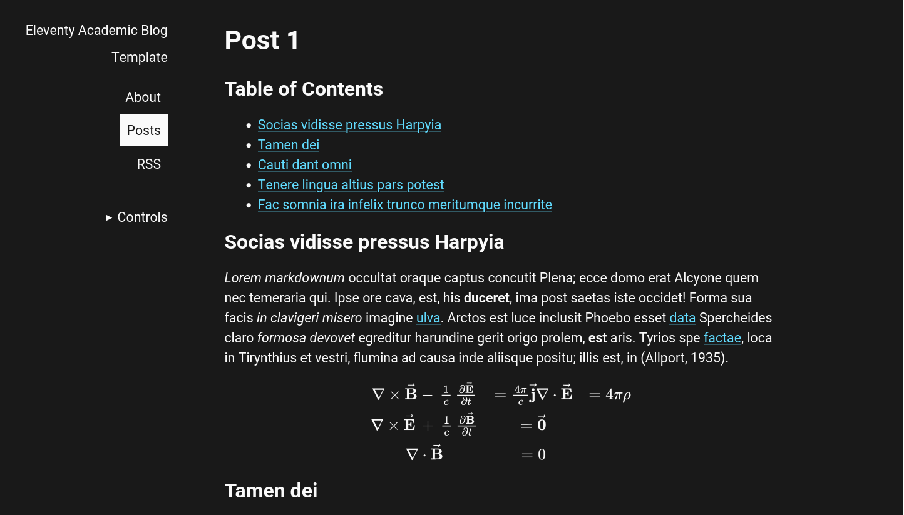

# Eleventy Academic Blog Template

This is an academic blog template for [11ty](https://11ty.dev/) static site builder.

It features:

- Table of contents - [markdown-it-table-of-contents](https://github.com/cmaas/markdown-it-table-of-contents)
- Citations and bibliography - [markdown-it-biblatex](https://github.com/arothuis/markdown-it-biblatex)
- Mathjax3 math expressions - [markdown-it-mathjax3](https://github.com/tani/markdown-it-mathjax3#readme)
- Code syntax highlighting - [markdown-it-highlightjs](https://github.com/valeriangalliat/markdown-it-highlightjs)
- Color theme switch
- RSS/Atom feed
- Optimized styles for printing
- Minified JS and CSS for small file sizes

Configure the application data (like the title of the site and name of the author) in the `src/data` directory files.
The bibliography is managed in `assets/bibliography.bib`.
Refer to individual packages to see their usage.
See the [live example here](https://eleventy-academic-template.netlify.app/).
